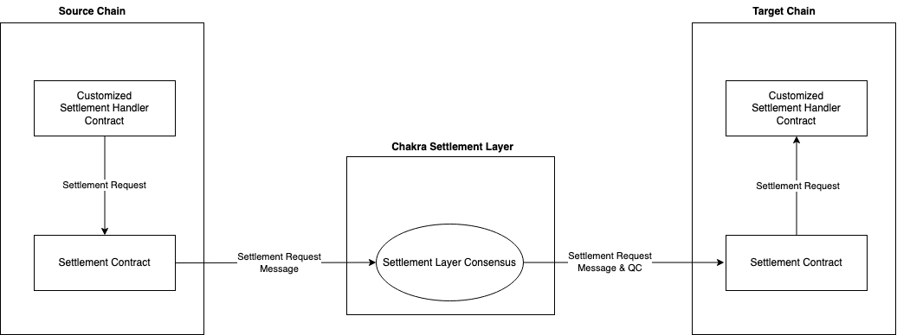

# Introduction

## Overview

Chakra Network is the first modular settlement layer designed to unlock Bitcoin's liquidity across diverse blockchain ecosystems. Chakra offers a high-performance and parallelized modular settlement solution for efficient liquidity flow across Execution Layers and BTC Mainnet.

Chakra Network provides a shared settlement layer that enhances Bitcoin's integration into the broader blockchain landscape, enabling other execution layers such as L2's to focus on execution without the complexities of building settlement infrastructure. This innovative approach unlocks interconnected liquidity and economic security, fostering a dynamic and vibrant ecosystem.

Execution layers benefit from Chakra's robust liquidity network effects, ensuring secure and scalable transaction processing. Chakra Network empowers Bitcoin ecosystem participants to drive growth and innovation within a safe, scalable, and interoperable framework. In addition, it enables DeFi projects to settle native BTC to target chains without friction, which extends the composability and utilities of their tokenized assets.&#x20;

<figure><figcaption>
Overview of Chakra Settlement
</figcaption></figure>

Please navigate to [Getting Started](chakra-settlement-layer/getting-started.md) to integrate with Chakra to make cross-chain settlement.

## Key Benefits of Integrating with Chakra

### For Liquid Staking/Restaking Protocols

#### Settlement of NATIVE BTC to the target chain through Chakra

Through the [Settlement Artifact](concepts/chakra-settlement-artifacts/), protocols can settle NATIVE BTC asset to any supported chain of Chakra. Each Settlement Artifact, implemented as a smart contract on Chakra settlement layer, is able to maintain the security of native BTC settlement. When there is a significant imbalance between LRT/LST and the underlying BTC assets, the presence of the Settlement Artifact ensures that the Settlement Primitives can continue to function normally.

* [Please see here for implementation of omni-chain liquidity accessibility as Native BTC](guides/access-omni-chain-liquidity-as-native-btc.md)

#### Efficient Cross-chain Liquidity Utilization and Redemption

By integrating with Chakra, Liquid Staking protocols can efficiently utilize liquidity across multiple chains. This integration allows staked assets to move seamlessly between different blockchain networks, optimizing the liquidity flow and ensuring that assets are always available where they are needed most.&#x20;

* [For the implementation of handling cross-chain liquidity transfer, please see here.](guides/cross-chain-transfer-with-settlement-layer.md)

Chakra’s robust cross-chain mechanisms reduce the friction associated with moving assets between chains. This efficiency minimizes delays and costs, making it more attractive for users and protocols to participate in staking and restaking activities. Meanwhile, users can easily redeem their staked tokens back to their original assets (e.g., stoneBTC to native BTC) without navigating complex procedures or incurring significant delays.

* [Please see here for the implementation of a contract with settlement to BTC main net. ](guides/staking-settlement-artifacts-with-native-btc-withdraw.md)

Unlike other chains, Chakra enhances user experience by using multi-chain gas estimation. The Chakra network routes each cross-chain settlement message to its target chain, and at the time of transaction initiation, users obtain the required gas for multiple chains through the Chakra gas service. This includes:

* Gas to be pre-paid on the source chain
* Gas to be pre-paid on the destination chain

After the cross-chain settlement message execution is completed, Chakra calculates the actual gas used and refunds the excess to the payer's account.

* For details on gas fee estimates, please refer [here](chakra-settlement-layer/gas/)&#x20;

#### Composability of Strategies

Staked assets can be more easily accessed across different DeFi platforms, increasing their utility and value. This accessibility ensures that assets are not locked within a single chain, but can contribute to liquidity pools, yield farming, and other DeFi strategies across multiple ecosystems.

Developers can create composable smart contracts that interact with Chakra’s Settlement Layer, enabling complex strategies that involve multiple steps, multiple artifacts, and interactions across different chains. This capability enhances the flexibility and power of staking protocols.

* [For the implementation of single artifact as an ERC-20 token, please see here](resources/contracts-and-script-templates/settlement-handler-contract/)

#### Enhanced Utilities and Stabilities of LRT and LST

Liquid Staking Tokens (LST) and Liquid Restaking Tokens (LRT) gain increased liquidity and tradability when integrated with Chakra. These tokens can be easily moved and utilized across various blockchain networks, enhancing their market presence and utility.

The ability to use LST and LRT across different chains increases their appeal to a wider range of users and investors. As the adoption rate of LST/LRT gradually increases, the liquidity depth of LST/LRT in DeFi protocols also grows, greatly enhancing stability. Additionally, frictionless interoperability significantly reduces the cost and difficulty of arbitrage. A large amount of arbitrage activity will ensure that the peg between LST/LRT and BTC remains very stable. This broader market participation drives demand and liquidity, further enhancing the value and utility of these tokens.

* [Please see here for the implementation of strategy composability with multiple settlement artifacts. ](guides/liquidity-composability-via-chakra-settlement-layer.md)

### For Layer 2's and Execution Layers

Integrating Layer 2 solutions with the Chakra Settlement Layer provides significant advantages that enhance the performance, utility, and user experience of L2 networks. For the full[ instructions of integration](guides/layer-2s-and-execution-layer-integration/), please see [here](guides/layer-2s-and-execution-layer-integration/).&#x20;

#### Efficient Cross-Chain Liquidity Utilization

Chakra enables L2 solutions to efficiently manage and utilize liquidity across multiple chains. By facilitating efficient cross-chain transactions, Chakra helps minimize the transaction costs associated with moving assets between L2‘s and other networks. In addition, integrating with Chakra ensures that assets on L2 networks are readily available for use in various DeFi protocols across different chains.

#### Enhanced Utility of the Chain Token and Increased Composability of Assets

Integrating with Chakra enhances the liquidity and tradability of tokens of and on L2 networks. It enables L2 tokens to access yield opportunities on various blockchain networks through Chakra.&#x20;

Meanwhile, Chakra supports the development of composable smart contracts that interact with multiple blockchain networks. Developers can create complex financial products that leverage the composability of Chakra’s Settlement Layer. These products can include multi-chain yield farming, cross-chain lending, and synthetic asset creation, providing more sophisticated investment opportunities for users.

